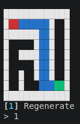

*This project has been created as part of the 42 curriculum by arsokolo, ascheufe.*

# A-Maze-ing

## Description

A-Maze-ing is a Python maze generator and solver. Given a plain-text configuration
file (width, height, entry/exit coordinates, seed, etc.), the program generates a
maze on a rectangular grid, guarantees it can be solved from the entry to the exit
if exit/entry is not placed into the 42 pattern,
writes it to disk using a compact hexadecimal wall encoding, and displays it live
in the terminal with colours, an optional shortest-path overlay, and a visible "42"
carved into the maze layout.

The generator can also be reused on its own: the core logic lives in the `mazegen`
package, which is installable independently via `pip` and has no dependency on the
CLI, config parser, or terminal display.

## Instructions

Requirements: Python 3.10+ and [`uv`](https://docs.astral.sh/uv/) (used both by
the Makefile and directly below to manage the virtual environment and
dependencies).

There are three ways to run the project:

### 1. Directly with `uv`

No `make` involved — `uv` resolves the venv and dependencies on the fly and
runs the CLI:

```sh
uv sync                              # installs pydantic, rich, and dev tools
uv run python a_maze_ing.py config.txt   # or any other config file path
```

### 2. With the Makefile

```sh
make install       # uv sync — installs pydantic, rich, and dev tools
make run            # uv run python a_maze_ing.py config.txt
make debug          # same, but under Python's pdb
make lint           # flake8 + mypy (matches the mandatory CI checks)
make lint-strict    # same, but with `mypy --strict`
make clean          # removes __pycache__ / .mypy_cache / .pytest_cache
```

`run` and `debug` read from two overridable Makefile variables, `ENTRY`
(default `a_maze_ing.py`) and `CONFIG` (default `config.txt`); `lint` and
`lint-strict` only use `ENTRY`, since linting doesn't need a config file.
Pass either as `VAR=value` to point at a different entry point or config
file without editing the Makefile:

```sh
make run CONFIG=my_config.txt          # generate from a different config
make debug CONFIG=config.txt.example   # debug with a specific config
make lint ENTRY=a_maze_ing.py          # override the linted entry point
```

### 3. Via `pip`, installing the `mazegen` wheel

The CLI itself (`a_maze_ing.py`) isn't packaged — only the reusable
`mazegen` core is (see [Building the package](#building-the-package)
below). To use just that package in another project, without `uv` or the
rest of this repo:

```sh
pip install dist/a_maze_ing-1.0.0-py3-none-any.whl
python3 -c "from mazegen import MazeGenerator; print(MazeGenerator)"
```

See [Basic usage](#basic-usage) below for how to drive `MazeGenerator`
directly once it's installed this way.

`config.txt` (or any other config path passed as the single argument) is parsed,
validated, and used to generate the maze. Any error (missing file, bad syntax,
out-of-bounds entry/exit, impossible parameters, ...) is reported with a clear
message on stderr instead of crashing the program.

Once the maze is generated it is written to the file named by `OUTPUT_FILE` and an
interactive terminal view opens with the following controls:

| Key | Action                                   |
|-----|-------------------------------------------|
| `1` | Regenerate a new maze and redisplay it     |
| `2` | Show/hide the shortest path from entry to exit |
| `3` | Cycle the wall colour                      |
| `q` | Quit                                       |

### Example

Terminal rendering of a small maze, with the entry (red), exit (green), and
shortest path (blue) shown:



## Configuration file format

One `KEY=VALUE` pair per line. Lines starting with `#` are comments and are
ignored, as is any trailing `# comment` on a value line. Whitespace is stripped.

| Key           | Description                       | Example              |
|---------------|------------------------------------|-----------------------|
| `WIDTH`       | Maze width, number of cells (≥ 2)  | `WIDTH=20`            |
| `HEIGHT`      | Maze height, number of cells (≥ 2) | `HEIGHT=15`           |
| `ENTRY`       | Entry coordinates `x,y`            | `ENTRY=0,0`           |
| `EXIT`        | Exit coordinates `x,y`             | `EXIT=19,14`          |
| `OUTPUT_FILE` | Output filename                    | `OUTPUT_FILE=maze.txt`|
| `PERFECT`     | `True`/`False` — single unique path between entry and exit | `PERFECT=True` |
| `SEED`        | *(optional)* Integer seed for reproducible generation | `SEED=42` |

Example (see [`config.txt`](config.txt) at the repository root for the default one
committed to the repo):

```
# This config file will be used by the maze generator
WIDTH=20
HEIGHT=15
ENTRY=0,0
EXIT=19,14
OUTPUT_FILE=maze.txt
PERFECT=True
SEED=42
```

## Maze generation algorithm

The maze is carved with an **iterative recursive backtracker** (randomized
depth-first search using an explicit stack instead of recursion):

1. Every cell starts fully walled (`0xF`: North/East/South/West all closed).
2. Starting from the `ENTRY` cell, the algorithm repeatedly looks at the current
   cell's unvisited neighbours, picks one at random, knocks down the wall between
   the two cells, marks the neighbour visited, and pushes it onto the stack.
3. When a cell has no unvisited neighbours left, it backtracks (pops the stack)
   until it finds a cell that does, or the stack empties (all cells visited).
4. If `PERFECT=False`, a post-pass randomly removes a fraction of the remaining
   walls to add loops — but only if doing so would not open up a solid 3×3 area,
   keeping every corridor at most 2 cells wide.
5. Before carving starts, if the maze is large enough, a set of cells forming a
   "42" glyph is reserved and excluded from the search space, so those cells stay
   fully walled and the pattern remains visible in the final maze.

**Why this algorithm:** the recursive backtracker is simple to implement
iteratively (avoiding Python's recursion limit on large mazes), runs in linear
time in the number of cells, and — because it is a randomized spanning-tree
algorithm — produces a *perfect* maze by construction (no loops, exactly one path
between any two cells) whenever `PERFECT=True`. This also makes the "add loops
without opening a 3×3 area" step for imperfect mazes straightforward: it only has
to add edges to an existing spanning tree rather than build connectivity from
scratch. Reserving the "42" cells as blocked before the DFS runs keeps the pattern
carving logic separate from the main generation loop.

The solution path (used for the output file and the "show path" display toggle)
is computed separately with **A\*** search over the generated grid, in
[`src/mazegen/solver.py`](src/mazegen/solver.py):

1. The entry cell is pushed onto a min-heap (`open_list`) ordered by
   `f = g + h`, with `g = 0` (steps taken so far) and `h` the Manhattan
   distance from that cell to the exit.
2. The lowest-`f` cell is popped; if it's already in `closed` it's a stale
   heap entry and is skipped, otherwise it's added to `closed` — since the
   heuristic never overestimates, the first pop of a cell is guaranteed to
   have its final, minimal `g`.
3. If the popped cell is the exit, the path is rebuilt by following the
   `parent` map back to the entry, then reversed into entry→exit order (as
   both `(x, y)` cells and `"N"/"E"/"S"/"W"` steps for `maze.solution`).
4. Otherwise, each wall-open neighbour is checked: if reaching it through
   the current cell gives a lower `g` than previously recorded, its `g`,
   `parent`, and `f` are updated and it's pushed onto the heap.
5. If the heap empties before the exit is reached, `NoSolutionError` is
   raised (entry and exit aren't connected).

**Why this algorithm:** on a `PERFECT=True` maze every path is forced (it's
a spanning tree), so a plain BFS/DFS would do — but `PERFECT=False` mazes
have loops, and only a shortest-path search guarantees the solution shown
is actually the shortest. The Manhattan-distance heuristic is admissible
here (moves are strictly orthogonal, one cell at a time, so it never
overestimates the remaining distance), which makes A* both optimal and
faster than an unguided search like Dijkstra: it expands cells in the
general direction of the exit instead of spreading out evenly in every
direction.

## Reusable module

The generation and solving logic lives entirely in [`src/mazegen/`](src/mazegen),
a standalone package with no dependency on the CLI entry point, the config parser,
or the terminal display — it can be dropped into another project as-is.

Exports (see [`src/mazegen/__init__.py`](src/mazegen/__init__.py)):

- `MazeGenerator` — generates and (optionally) solves a maze.
- `write_maze` — writes a `MazeGenerator` instance to the hexadecimal output format
  described above.
- `NoSolutionError` — raised by the solver if entry and exit are not connected.

### Basic usage

```python
from mazegen import MazeGenerator, write_maze

maze = MazeGenerator(
    width=20,
    height=15,
    entry=(0, 0),
    exit=(19, 14),
    output_file="maze.txt",
    perfect=True,
    seed=42,          # None for a random, non-reproducible maze
)
maze.generate()

# Access the raw structure: a list[list[int]] grid, one hex bitmask per cell
# (bit 0=North, 1=East, 2=South, 3=West; 1 = wall closed)
print(maze.grid[0][0])

# Compute a solution: list of (x, y) cells from entry to exit
path = maze.solve()

# maze.solution now holds the same path as a list of "N"/"E"/"S"/"W" steps
print(maze.solution)

write_maze(maze)  # writes maze.grid / entry / exit / solution to output_file
```

`width`, `height`, `entry`, `exit`, `output_file`, `perfect`, and `seed` are all
constructor parameters — instantiate a new `MazeGenerator` (or call `.generate()`
again on the same instance) to get a differently sized or seeded maze.

### Building the package

The `mazegen` subpackage is packaged separately from the CLI (see
`[tool.hatch.build.targets.wheel]` in [`pyproject.toml`](pyproject.toml), which
restricts the wheel to `src/mazegen`). To rebuild it from source:

```sh
python3 -m pip install build
python3 -m build
```

This produces `dist/*.whl` and `dist/*.tar.gz`, installable with
`pip install dist/<file>`.

## Resources

- [Wikipedia — Maze generation algorithm](https://en.wikipedia.org/wiki/Maze_generation_algorithm)
- [Wikipedia — A* search algorithm](https://en.wikipedia.org/wiki/A*_search_algorithm)
- [Youtube — A* search algorithm](https://www.youtube.com/watch?v=ySN5Wnu88nE)
- [pydantic documentation](https://docs.pydantic.dev/) — used for config validation
- [uv documentation](https://docs.astral.sh/uv/) — dependency/venv management

**AI usage:** AI (an LLM assistant) was used as a learning tool to understand
concepts needed for the project (e.g. graph/spanning-tree algorithms, A* search,
mypy/flake8 configuration) while the team wrote the code themselves, and to
generate the initial skeleton of this README, which was then filled in and
corrected with project-specific details by the team.

## Team and project management

| Member | Login | Main focus |
|---|---|---|
| Artem Sokolov | `arsokolo` | Project scaffolding (`pyproject.toml`, `Makefile`, CI lint workflow, `.gitignore`), the `MazeGenerator` core (recursive backtracker, "42" pattern stamping, non-perfect loop generation), the output file writer, the terminal display loop, and packaging |
| Achilles Scheufele | `ascheufe` | Config file parsing and validation (`pydantic`-based `Config`/`load_config`), the A* solver (normal path and mazegen solution), path/colour display support and error-handling/edge-case fixes|

- **Planning:** work was split by domain from the start and developed on
  short-lived feature branches (`feature/scaffolding`, `feature/mazegen`,
  `config`) merged into `dev` via pull request, then finally into `main`. A late
  `refactor/final-touches` branch fixed a coordinate-convention bug (`(row, col)`
  vs `(x, y)`), tightened config error handling, and cleaned up docstrings before
  the final merge.
- **What worked well:** splitting by domain (generator/output/display vs.
  config/solver) let both people work in parallel with few merge conflicts, and
  routing everything through pull requests kept `main` stable.
- **What could be improved:** the `(x, y)` vs `(row, col)` convention wasn't
  agreed on up front, which caused a cluster of fix/refactor commits late in the
  project; settling on data conventions before writing the generator and solver
  would have avoided that rework.
- **Tools:** [`uv`](https://docs.astral.sh/uv/) for dependency and virtualenv
  management, `flake8` and `mypy` for linting/type-checking, `rich` for the
  terminal UI, `pydantic` for config validation, and GitHub Actions for CI.
